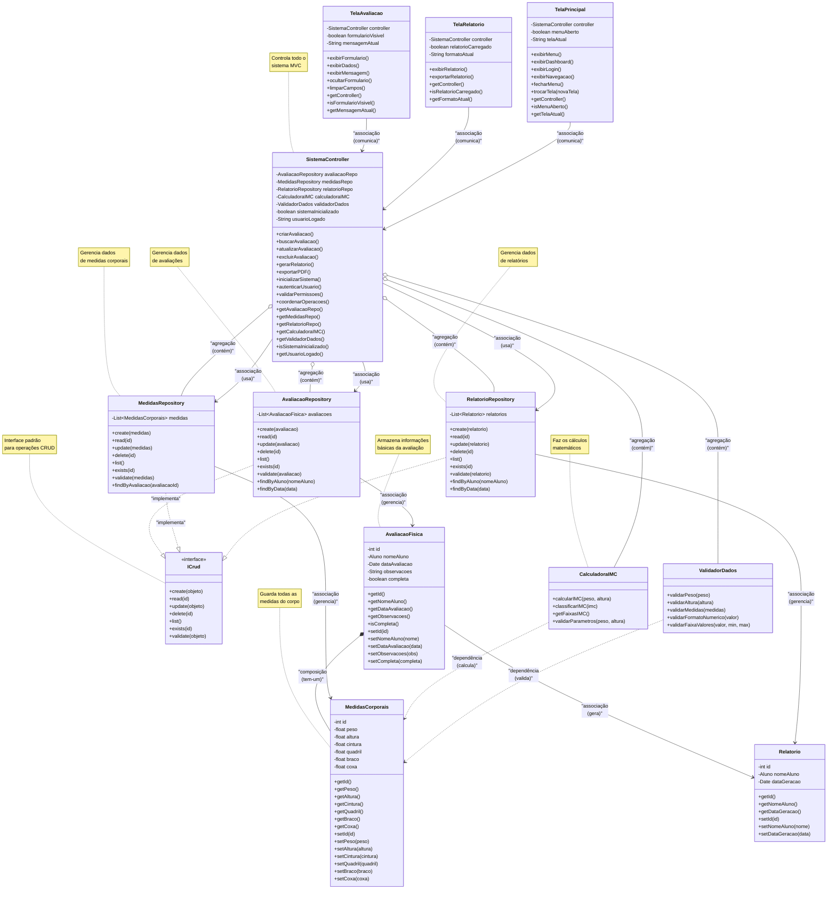

# Diagrama de Classes - Módulo Registro de evolucao fisica (Arquitetura MVC)

## Diagrama de Classes - Arquitetura MVC




## Arquitetura MVC - Descrição das Camadas

### **CAMADA MODEL (MODELOS + SERVIÇOS + UTILITÁRIOS + REPOSITÓRIOS)**

### 🔧 **INTERFACE CRUD**
Define o padrão para operações de banco de dados:

- **ICrud**: Interface genérica com métodos padrão (create, read, update, delete, list, exists, validate)

### 🗂️ **REPOSITÓRIOS (Implementam ICrud)**
São como "bibliotecários" que organizam e gerenciam os dados:

- **AvaliacaoRepository**: Gerencia dados de avaliações físicas
- **MedidasRepository**: Gerencia dados de medidas corporais  
- **RelatorioRepository**: Gerencia dados de relatórios

### 🗂️ **DADOS (Model)**
São como "gavetas" onde guardamos as informações:

- **AvaliacaoFisica**: Guarda informações básicas (nome do aluno, data, observações)
- **MedidasCorporais**: Guarda todas as medidas do corpo (peso, altura, cintura, etc.)
- **Relatorio**: Guarda informações dos relatórios gerados

### ⚙️ **LÓGICA DE NEGÓCIO (Services)**
São como "calculadoras inteligentes" que fazem os cálculos:

- **CalculadoraIMC**: Calcula o IMC e diz se está normal, acima do peso, etc.
- **ValidadorDados**: Verifica se os dados estão corretos (peso não pode ser negativo, etc.)

### 🎮 **CONTROLE (Controller)**
É como um "gerente geral" que coordena tudo:

- **SistemaController**: Controla todo o sistema - usa repositórios para gerenciar dados, coordena operações entre Model e View

### 🖥️ **INTERFACE (View)**
São as telas que o usuário vê e usa:

- **TelaAvaliacao**: Tela para preencher dados da avaliação
- **TelaRelatorio**: Tela para ver relatórios e gráficos
- **TelaPrincipal**: Tela principal com menu, dashboard e navegação

## Como Funciona na Prática?

1. **Usuário** acessa o sistema através da **TelaPrincipal**
2. **TelaPrincipal** comunica com o **SistemaController** para autenticação
3. **SistemaController** valida permissões e coordena acesso
4. **Usuário** preenche dados na **TelaAvaliacao**
5. **TelaAvaliacao** envia dados para o **SistemaController**
6. **SistemaController** pede para o **ValidadorDados** verificar se está tudo certo
7. **SistemaController** pede para o **CalculadoraIMC** calcular o IMC
8. **SistemaController** usa **AvaliacaoRepository** para salvar dados na **AvaliacaoFisica**
9. **SistemaController** usa **MedidasRepository** para salvar dados na **MedidasCorporais**
10. **SistemaController** avisa a **TelaAvaliacao** que deu tudo certo
11. **TelaRelatorio** solicita relatório ao **SistemaController**
12. **SistemaController** usa **RelatorioRepository** para gerar relatório baseado nos dados salvos

## 🔧 Interface CRUD - Padrão de Design

### **📋 O que é a Interface ICrud?**
A interface `ICrud` define um contrato padrão para operações de banco de dados:

```java
public interface ICrud<T> {
    T create(T objeto);           // Criar novo registro
    T read(int id);              // Ler registro por ID
    T update(T objeto);          // Atualizar registro existente
    boolean delete(int id);      // Excluir registro por ID
    List<T> list();             // Listar todos os registros
    boolean exists(int id);     // Verificar se registro existe
    boolean validate(T objeto);  // Validar dados antes de salvar
}
```

### **🎯 Benefícios da Interface CRUD:**

#### **✅ Padronização**
- Todos os repositórios seguem o mesmo padrão
- Métodos com nomes consistentes
- Comportamento previsível

#### **✅ Reutilização**
- Interface genérica (`<T>`) funciona com qualquer tipo
- Código comum pode ser compartilhado
- Fácil manutenção

#### **✅ Flexibilidade**
- Fácil trocar implementação (ex: de arquivo para banco)
- Testes unitários simplificados
- Injeção de dependência facilitada

### **🏗️ Implementação nos Repositórios:**

#### **AvaliacaoRepository**
```java
public class AvaliacaoRepository implements ICrud<AvaliacaoFisica> {
    // Implementa todos os métodos da interface ICrud
    // + métodos específicos: findByAluno(), findByData()
}
```

#### **MedidasRepository**
```java
public class MedidasRepository implements ICrud<MedidasCorporais> {
    // Implementa todos os métodos da interface ICrud
    // + métodos específicos: findByAvaliacao()
}
```

#### **RelatorioRepository**
```java
public class RelatorioRepository implements ICrud<Relatorio> {
    // Implementa todos os métodos da interface ICrud
    // + métodos específicos: findByAluno(), findByData()
}
```

### **💡 Vantagens desta Arquitetura:**
- ✅ **Consistência**: Todos os repositórios seguem o mesmo padrão
- ✅ **Manutenibilidade**: Mudanças na interface afetam todos os repositórios
- ✅ **Testabilidade**: Fácil criar mocks para testes
- ✅ **Escalabilidade**: Fácil adicionar novos repositórios

### 💻 **No Nosso Sistema**

#### **COMPOSIÇÃO**: `AvaliacaoFisica *-- MedidasCorporais`
- Uma avaliação física É COMPOSTA POR medidas corporais
- Se excluir a avaliação, as medidas também são excluídas
- As medidas não existem sem a avaliação

#### **AGREGAÇÃO**: `SistemaController o-- CalculadoraIMC`
- O SistemaController CONTÉM a CalculadoraIMC
- Se excluir o SistemaController, a CalculadoraIMC pode ser reutilizada
- A CalculadoraIMC pode existir independentemente

#### **ASSOCIAÇÃO**: `SistemaController --> AvaliacaoFisica`
- O controller GERENCIA as avaliações
- Controller e avaliação podem existir independentemente
- O controller pode gerenciar outras coisas também

#### **DEPENDÊNCIA**: `CalculadoraIMC ..> MedidasCorporais`
- A calculadora DEPENDE das medidas para calcular o IMC
- É um relacionamento temporário durante o cálculo
- A calculadora não possui as medidas, apenas as usa
