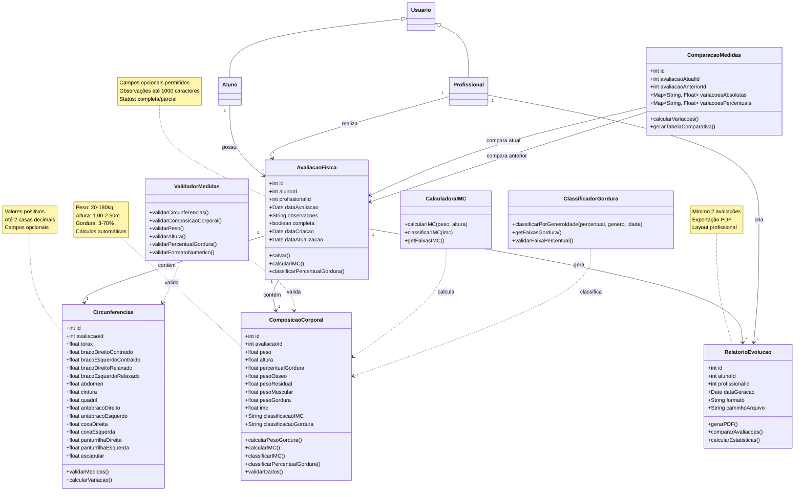

# Diagrama de Classes - Sistema de Registro de Circunferências Corporais

## Diagrama de Classes

## Descrição das Classes Principais

### **Usuario (Classe Base)**
- Classe abstrata que representa qualquer usuário do sistema
- Contém dados básicos de autenticação e perfil
- Implementa métodos de autenticação e validação de permissões

### **Aluno**
- Herda de Usuario
- Representa os alunos da academia
- Possui histórico de avaliações físicas
- Pode solicitar novas avaliações

### **Profissional**
- Herda de Usuario
- Representa instrutores e profissionais da academia
- Pode registrar avaliações físicas
- Pode gerar relatórios de evolução

### **AvaliacaoFisica**
- Entidade central do sistema
- Contém todas as medidas de uma avaliação
- Suporta campos opcionais
- Calcula automaticamente IMC e classificações

### **Circunferencias**
- Armazena todas as medidas de circunferência corporal
- Valida formato numérico e faixas de valores
- Calcula variações entre avaliações

### **ComposicaoCorporal**
- Armazena dados de peso, altura e composição corporal
- Calcula automaticamente IMC e peso de gordura
- Classifica percentual de gordura por faixas etárias

### **RelatorioEvolucao**
- Gera relatórios em PDF
- Compara avaliações temporais
- Requer mínimo de 2 avaliações

### **ValidadorMedidas**
- Classe utilitária para validações
- Valida formatos numéricos e faixas de valores
- Garante integridade dos dados

### **CalculadoraIMC**
- Calcula IMC usando fórmula padrão
- Classifica IMC em faixas da OMS
- Retorna classificações padronizadas

### **ClassificadorGordura**
- Classifica percentual de gordura por gênero e idade
- Implementa tabelas de referência
- Valida faixas aceitáveis

## Funcionalidades Implementadas

✅ **US10**: Registro de circunferências corporais (AC1-AC3)
✅ **US13**: Registro de peso, altura e percentual de gordura (AC4-AC9)
✅ **US17**: Adição de observações (AC10-AC15)
✅ **US15**: Visualização do histórico (AC16-AC19)
✅ **US12**: Registro múltiplas medidas (AC20-AC25)
✅ **US14**: Visualização do IMC (AC26-AC30)
✅ **US16**: Geração de relatórios (AC31-AC33)
✅ **US11**: Comparação de medidas (AC34-AC36)

## Padrões de Design Utilizados

- **Herança**: Usuario como classe base para Aluno e Profissional
- **Composição**: AvaliacaoFisica composta por Circunferencias e ComposicaoCorporal
- **Validação**: Classes utilitárias para validação e cálculo
- **Separação de Responsabilidades**: Cada classe tem uma responsabilidade específica
