# Diagrama de Classes - Módulo Registro de evolucao fisica (Arquitetura MVC)

## Diagrama de Classes - Arquitetura MVC

```mermaid
classDiagram
    %% ===== DADOS (MODEL) =====
    %% Aqui ficam as informações que o sistema guarda
    
    %% Estilo para classe Aluno (cor vermelha)
    classDef alunoClass fill:#ff6b6b,stroke:#d63031,stroke-width:2px,color:#fff
    
    class AvaliacaoFisica {
        -int id
        -Aluno Aluno
        -Date dataAvaliacao
        -String observacoes
        -boolean completa
        +getId()
        +getNomeAluno()
        +getDataAvaliacao()
        +getObservacoes()
        +isCompleta()
        +setId(id)
        +setNomeAluno(nome)
        +setDataAvaliacao(data)
        +setObservacoes(obs)
        +setCompleta(completa)
    }

    class Aluno {
        -int id
        -String nome
        -String email
        -Date dataNascimento
        -String telefone
        -boolean ativo
        +getId()
        +getNome()
        +getEmail()
        +getDataNascimento()
        +getTelefone()
        +isAtivo()
        +setId(id)
        +setNome(nome)
        +setEmail(email)
        +setDataNascimento(data)
        +setTelefone(telefone)
        +setAtivo(ativo)
    }
    
    %% Aplicar estilo vermelho à classe Aluno
    class Aluno alunoClass
 

    class MedidasCorporais {
        -int id
        -float peso
        -float altura
        -float cintura
        -float quadril
        -float braco
        -float coxa
        +getId()
        +getPeso()
        +getAltura()
        +getCintura()
        +getQuadril()
        +getBraco()
        +getCoxa()
        +setId(id)
        +setPeso(peso)
        +setAltura(altura)
        +setCintura(cintura)
        +setQuadril(quadril)
        +setBraco(braco)
        +setCoxa(coxa)
    }

    class Relatorio {
        -int id
        -Aluno nomeAluno
        -Date dataGeracao
        +getId()
        +getNomeAluno()
        +getDataGeracao()
        +setId(id)
        +setNomeAluno(nome)
        +setDataGeracao(data)
    }

    %% ===== LÓGICA DE NEGÓCIO (SERVICES) =====
    %% Aqui ficam os cálculos e validações
    
    class CalculadoraIMC {
        +calcularIMC(peso, altura)
        +classificarIMC(imc)
        +getFaixasIMC()
        +validarParametros(peso, altura)
    }

    class ValidadorDados {
        +validarPeso(peso)
        +validarAltura(altura)
        +validarMedidas(medidas)
        +validarFormatoNumerico(valor)
        +validarFaixaValores(valor, min, max)
    }

    %% ===== CONTROLE (CONTROLLER) =====
    %% Aqui ficam as operações principais
    
    class SistemaController {
        -CalculadoraIMC calculadoraIMC
        -ValidadorDados validadorDados
        -boolean sistemaInicializado
        -String usuarioLogado
        +criarAvaliacao()
        +buscarAvaliacao()
        +atualizarAvaliacao()
        +excluirAvaliacao()
        +gerarRelatorio()
        +exportarPDF()
        +inicializarSistema()
        +autenticarUsuario()
        +validarPermissoes()
        +coordenarOperacoes()
        +getCalculadoraIMC()
        +getValidadorDados()
        +isSistemaInicializado()
        +getUsuarioLogado()
    }

    %% ===== INTERFACE (VIEW) =====
    %% Aqui ficam as telas que o usuário vê
    
    class TelaAvaliacao {
        -SistemaController controller
        -boolean formularioVisivel
        -String mensagemAtual
        +exibirFormulario()
        +exibirDados()
        +exibirMensagem()
        +ocultarFormulario()
        +limparCampos()
        +getController()
        +isFormularioVisivel()
        +getMensagemAtual()
    }

    class TelaRelatorio {
        -SistemaController controller
        -boolean relatorioCarregado
        -String formatoAtual
        +exibirRelatorio()
        +exportarRelatorio()
        +getController()
        +isRelatorioCarregado()
        +getFormatoAtual()
    }

    class TelaPrincipal {
        -SistemaController controller
        -boolean menuAberto
        -String telaAtual
        +exibirMenu()
        +exibirDashboard()
        +exibirLogin()
        +exibirNavegacao()
        +fecharMenu()
        +trocarTela(novaTela)
        +getController()
        +isMenuAberto()
        +getTelaAtual()
    }

    %% ===== RELACIONAMENTOS MVC COM CARDINALIDADES =====
    
    %% Relacionamentos de COMPOSIÇÃO (Composição - forte dependência)
    %% Uma AvaliacaoFisica É COMPOSTA POR MedidasCorporais
    %% CORREÇÃO: MedidasCorporais não pode existir sem AvaliacaoFisica
    AvaliacaoFisica "1" *-- "1" MedidasCorporais : "composição<br/>(tem-um)"
    
    %% Relacionamentos de AGREGAÇÃO (Agregação - dependência média)
    %% CORREÇÃO: Services podem existir independentemente do Controller
    SistemaController "1" o-- "1" CalculadoraIMC : "agregação<br/>(usa)"
    SistemaController "1" o-- "1" ValidadorDados : "agregação<br/>(usa)"
    
    %% Relacionamentos de ASSOCIAÇÃO (Associação - relacionamento fraco)
    %% CORREÇÃO: Relatorio pode existir independentemente de AvaliacaoFisica
    AvaliacaoFisica "1" --> "0..*" Relatorio : "associação<br/>(gera)"
    
    %% Relacionamentos Aluno (Agregação)
    %% CORREÇÃO: AvaliacaoFisica CONTÉM uma instância de Aluno
    AvaliacaoFisica "1" o-- "1" Aluno : "agregação<br/>(contém)"
    %% CORREÇÃO: Relatorio CONTÉM uma instância de Aluno
    Relatorio "1" o-- "1" Aluno : "agregação<br/>(contém)"
    
    %% Relacionamentos Controller -> Model (Associações)
    %% CORREÇÃO: Controller gerencia mas não possui os modelos
    SistemaController "1" --> "0..*" AvaliacaoFisica : "associação<br/>(gerencia)"
    SistemaController "1" --> "0..*" MedidasCorporais : "associação<br/>(manipula)"
    SistemaController "1" --> "0..*" Relatorio : "associação<br/>(gerencia)"
    SistemaController "1" --> "0..*" Aluno : "associação<br/>(gerencia)"
    
    %% Relacionamentos View -> Controller (Associações)
    %% CORREÇÃO: Views dependem do Controller para funcionar
    TelaAvaliacao "1" --> "1" SistemaController : "associação<br/>(comunica)"
    TelaRelatorio "1" --> "1" SistemaController : "associação<br/>(comunica)"
    TelaPrincipal "1" --> "1" SistemaController : "associação<br/>(comunica)"
    
    %% Relacionamentos Service -> Model (Dependências)
    %% CORREÇÃO: Services dependem temporariamente dos modelos
    CalculadoraIMC "1" ..> "0..*" MedidasCorporais : "dependência<br/>(calcula)"
    ValidadorDados "1" ..> "0..*" MedidasCorporais : "dependência<br/>(valida)"

    %% Notas explicativas
    note for Aluno "Representa um aluno<br/>do sistema (Não será implemtada)"
    
    note for AvaliacaoFisica "Armazena informações<br/>básicas da avaliação"
    
    note for MedidasCorporais "Guarda todas as<br/>medidas do corpo"
    
    note for CalculadoraIMC "Faz os cálculos<br/>matemáticos"
    
    note for SistemaController "Controla todo o<br/>sistema MVC"
```

## Arquitetura MVC - Descrição das Camadas

### **CAMADA MODEL (MODELOS + SERVIÇOS + UTILITÁRIOS)**

### 🗂️ **DADOS (Model)**
São como "gavetas" onde guardamos as informações:

- **Aluno**: Representa um aluno do sistema (nome, email, telefone, etc.) - **CLASSE VERMELHA**
- **AvaliacaoFisica**: Guarda informações básicas (aluno, data, observações)
- **MedidasCorporais**: Guarda todas as medidas do corpo (peso, altura, cintura, etc.)
- **Relatorio**: Guarda informações dos relatórios gerados

### ⚙️ **LÓGICA DE NEGÓCIO (Services)**
São como "calculadoras inteligentes" que fazem os cálculos:

- **CalculadoraIMC**: Calcula o IMC e diz se está normal, acima do peso, etc.
- **ValidadorDados**: Verifica se os dados estão corretos (peso não pode ser negativo, etc.)

### 🎮 **CONTROLE (Controller)**
É como um "gerente geral" que coordena tudo:

- **SistemaController**: Controla todo o sistema - avaliações, relatórios, autenticação e coordenação geral

### 🖥️ **INTERFACE (View)**
São as telas que o usuário vê e usa:

- **TelaAvaliacao**: Tela para preencher dados da avaliação
- **TelaRelatorio**: Tela para ver relatórios e gráficos
- **TelaPrincipal**: Tela principal com menu, dashboard e navegação

## Como Funciona na Prática?

1. **Usuário** acessa o sistema através da **TelaPrincipal**
2. **TelaPrincipal** comunica com o **SistemaController** para autenticação
3. **SistemaController** valida permissões e coordena acesso
4. **SistemaController** busca dados do **Aluno** (classe vermelha) no sistema
5. **Usuário** preenche dados na **TelaAvaliacao**
6. **TelaAvaliacao** envia dados para o **SistemaController**
7. **SistemaController** pede para o **ValidadorDados** verificar se está tudo certo
8. **SistemaController** pede para o **CalculadoraIMC** calcular o IMC
9. **SistemaController** salva os dados na **AvaliacaoFisica** e **MedidasCorporais**
10. **SistemaController** avisa a **TelaAvaliacao** que deu tudo certo
11. **TelaRelatorio** solicita relatório ao **SistemaController**
12. **SistemaController** gera relatório baseado nos dados salvos do **Aluno**

## 🔴 Classe Aluno - Destaque Especial

### **📋 Características da Classe Aluno:**
- **Cor**: Vermelha (destaque visual no diagrama)
- **Função**: Representa um aluno do sistema
- **Atributos**: ID, nome, email, data de nascimento, telefone, status ativo
- **Métodos**: Getters e setters para todos os atributos

### **🔗 Relacionamentos da Classe Aluno:**

#### **ASSOCIAÇÃO**: `Aluno --> AvaliacaoFisica`
- **Significado**: Um aluno POSSUI avaliações físicas
- **Tipo**: Relacionamento um-para-muitos (1:N)
- **Características**:
  - Um aluno pode ter várias avaliações
  - Uma avaliação pertence a um único aluno
  - Relacionamento independente

#### **ASSOCIAÇÃO**: `Aluno --> Relatorio`
- **Significado**: Um aluno RECEBE relatórios
- **Tipo**: Relacionamento um-para-muitos (1:N)
- **Características**:
  - Um aluno pode receber vários relatórios
  - Um relatório é gerado para um aluno específico
  - Relacionamento independente

#### **ASSOCIAÇÃO**: `SistemaController --> Aluno`
- **Significado**: O controller GERENCIA os alunos
- **Tipo**: Relacionamento um-para-muitos (1:N)
- **Características**:
  - O controller pode gerenciar vários alunos
  - Operações CRUD (criar, buscar, atualizar, excluir)
  - Relacionamento de controle

### **🎯 Por que a Classe Aluno é Vermelha?**
- ✅ **Destaque Visual**: Facilita identificação no diagrama
- ✅ **Importância**: Classe central do sistema
- ✅ **Referência**: Fácil localização em discussões
- ✅ **Organização**: Separação visual das outras classes

### **💡 Benefícios da Classe Aluno:**
- ✅ **Centralização**: Todos os dados do aluno em um local
- ✅ **Reutilização**: Pode ser usada em diferentes contextos
- ✅ **Integridade**: Dados consistentes e validados
- ✅ **Escalabilidade**: Fácil adicionar novos atributos

## 🔧 Análise e Correção dos Relacionamentos UML

### **❌ Problemas Identificados e Corrigidos:**

#### **1. AGREGAÇÃO vs ASSOCIAÇÃO - SistemaController**
- **❌ Problema**: `SistemaController o-- CalculadoraIMC` com "(contém)"
- **✅ Correção**: `SistemaController o-- CalculadoraIMC` com "(usa)"
- **Justificativa**: Services podem existir independentemente do Controller

#### **2. COMPOSIÇÃO - AvaliacaoFisica e MedidasCorporais**
- **✅ Correto**: `AvaliacaoFisica *-- MedidasCorporais`
- **Justificativa**: MedidasCorporais não pode existir sem AvaliacaoFisica

#### **3. ASSOCIAÇÃO - Aluno e AvaliacaoFisica**
- **✅ Correto**: `Aluno --> AvaliacaoFisica`
- **Justificativa**: Aluno pode existir sem avaliações

#### **4. AGREGAÇÃO - AvaliacaoFisica e Aluno**
- **✅ Correto**: `AvaliacaoFisica o-- Aluno`
- **Justificativa**: AvaliacaoFisica contém uma instância de Aluno

#### **5. AGREGAÇÃO - Relatorio e Aluno**
- **✅ Correto**: `Relatorio o-- Aluno`
- **Justificativa**: Relatorio contém uma instância de Aluno

#### **6. ASSOCIAÇÃO - AvaliacaoFisica e Relatorio**
- **✅ Correto**: `AvaliacaoFisica --> Relatorio`
- **Justificativa**: Relatorio pode existir independentemente

### **🎯 Regras UML Aplicadas:**

#### **COMPOSIÇÃO (*--)**
- **Critério**: "É composto por" - dependência forte
- **Características**:
  - Mesma vida útil
  - Não pode existir independentemente
  - Exemplo: AvaliacaoFisica *-- MedidasCorporais

#### **AGREGAÇÃO (o--)**
- **Critério**: "Contém" ou "Usa" - dependência média
- **Características**:
  - Vida útil independente
  - Pode existir separadamente
  - Exemplo: SistemaController o-- CalculadoraIMC

#### **ASSOCIAÇÃO (-->)**
- **Critério**: "Relaciona-se com" - dependência fraca
- **Características**:
  - Relacionamento temporário
  - Independência total
  - Exemplo: Aluno --> AvaliacaoFisica

#### **DEPENDÊNCIA (..>)**
- **Critério**: "Usa temporariamente" - dependência muito fraca
- **Características**:
  - Uso momentâneo
  - Não possui o objeto
  - Exemplo: CalculadoraIMC ..> MedidasCorporais

### **💡 Benefícios das Correções:**
- ✅ **Precisão**: Relacionamentos refletem a realidade do sistema
- ✅ **Clareza**: Fácil entender dependências entre classes
- ✅ **Manutenibilidade**: Mudanças não quebram relacionamentos incorretos
- ✅ **Padrão UML**: Segue convenções estabelecidas

## 📊 Cardinalidades dos Relacionamentos

### **🔢 O que são Cardinalidades?**
As cardinalidades especificam quantos objetos de cada classe podem estar relacionados:

- **"1"**: Exatamente um objeto
- **"0..1"**: Zero ou um objeto (opcional)
- **"0..*"**: Zero ou muitos objetos (opcional, múltiplos)
- **"1..*"**: Um ou muitos objetos (obrigatório, múltiplos)
- **"*"**: Muitos objetos (múltiplos)

### **📋 Cardinalidades Implementadas:**
Cardinalidades
#### **COMPOSIÇÃO com Cardinalidade**
- **`AvaliacaoFisica "1" *-- "1" MedidasCorporais`**
  - **Significado**: Uma avaliação física tem exatamente uma medida corporal
  - **Cardinalidade**: 1:1 (um para um)

#### **AGREGAÇÃO com Cardinalidade**
- **`SistemaController "1" o-- "1" CalculadoraIMC`**
  - **Significado**: Um controller usa exatamente uma calculadora
  - **Cardinalidade**: 1:1 (um para um)

- **`SistemaController "1" o-- "1" ValidadorDados`**
  - **Significado**: Um controller usa exatamente um validador
  - **Cardinalidade**: 1:1 (um para um)

#### **AGREGAÇÃO com Cardinalidade**
- **`AvaliacaoFisica "1" o-- "1" Aluno`**
  - **Significado**: Uma avaliação física contém uma instância de aluno
  - **Cardinalidade**: 1:1 (um para um)

- **`Relatorio "1" o-- "1" Aluno`**
  - **Significado**: Um relatório contém uma instância de aluno
  - **Cardinalidade**: 1:1 (um para um)

#### **ASSOCIAÇÃO com Cardinalidade**
- **`AvaliacaoFisica "1" --> "0..*" Relatorio`**
  - **Significado**: Uma avaliação pode gerar zero ou muitos relatórios
  - **Cardinalidade**: 1:N (um para muitos)

- **`SistemaController "1" --> "0..*" Aluno`**
  - **Significado**: Um controller gerencia zero ou muitos alunos
  - **Cardinalidade**: 1:N (um para muitos)

#### **VIEW com Cardinalidade**
- **`TelaAvaliacao "1" --> "1" SistemaController`**
  - **Significado**: Uma tela comunica com exatamente um controller
  - **Cardinalidade**: 1:1 (um para um)

#### **DEPENDÊNCIA com Cardinalidade**
- **`CalculadoraIMC "1" ..> "0..*" MedidasCorporais`**
  - **Significado**: Uma calculadora pode calcular zero ou muitas medidas
  - **Cardinalidade**: 1:N (um para muitos)

### **🎯 Benefícios das Cardinalidades:**
- ✅ **Precisão**: Define exatamente quantos objetos podem se relacionar
- ✅ **Validação**: Facilita validação de dados no sistema
- ✅ **Documentação**: Torna o diagrama mais claro e completo
- ✅ **Implementação**: Guia o desenvolvimento do código

### 💻 **No Nosso Sistema**

#### **COMPOSIÇÃO**: `AvaliacaoFisica *-- MedidasCorporais`
- Uma avaliação física É COMPOSTA POR medidas corporais
- Se excluir a avaliação, as medidas também são excluídas
- As medidas não existem sem a avaliação

#### **AGREGAÇÃO**: `SistemaController o-- CalculadoraIMC`
- O SistemaController CONTÉM a CalculadoraIMC
- Se excluir o SistemaController, a CalculadoraIMC pode ser reutilizada
- A CalculadoraIMC pode existir independentemente

#### **ASSOCIAÇÃO**: `SistemaController --> AvaliacaoFisica`
- O controller GERENCIA as avaliações
- Controller e avaliação podem existir independentemente
- O controller pode gerenciar outras coisas também

#### **DEPENDÊNCIA**: `CalculadoraIMC ..> MedidasCorporais`
- A calculadora DEPENDE das medidas para calcular o IMC
- É um relacionamento temporário durante o cálculo
- A calculadora não possui as medidas, apenas as usa
