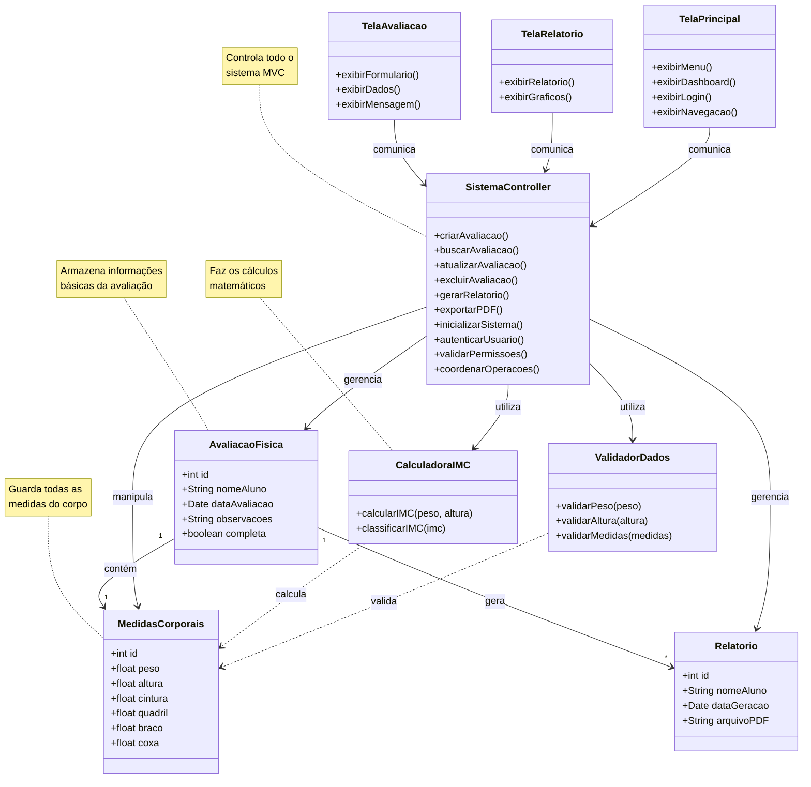

# Diagrama de Classes - Sistema de Registro de evolucao fisica (Arquitetura MVC)

## Diagrama de Classes - Arquitetura MVC

## Arquitetura MVC - Descrição das Camadas

### **CAMADA MODEL (MODELOS + SERVIÇOS + UTILITÁRIOS)**

### 🗂️ **DADOS (Model)**
São como "gavetas" onde guardamos as informações:

- **AvaliacaoFisica**: Guarda informações básicas (nome do aluno, data, observações)
- **MedidasCorporais**: Guarda todas as medidas do corpo (peso, altura, cintura, etc.)
- **Relatorio**: Guarda informações dos relatórios gerados

### ⚙️ **LÓGICA DE NEGÓCIO (Services)**
São como "calculadoras inteligentes" que fazem os cálculos:

- **CalculadoraIMC**: Calcula o IMC e diz se está normal, acima do peso, etc.
- **ValidadorDados**: Verifica se os dados estão corretos (peso não pode ser negativo, etc.)

### 🎮 **CONTROLE (Controller)**
É como um "gerente geral" que coordena tudo:

- **SistemaController**: Controla todo o sistema - avaliações, relatórios, autenticação e coordenação geral

### 🖥️ **INTERFACE (View)**
São as telas que o usuário vê e usa:

- **TelaAvaliacao**: Tela para preencher dados da avaliação
- **TelaRelatorio**: Tela para ver relatórios e gráficos
- **TelaPrincipal**: Tela principal com menu, dashboard e navegação

## Como Funciona na Prática?

1. **Usuário** acessa o sistema através da **TelaPrincipal**
2. **TelaPrincipal** comunica com o **SistemaController** para autenticação
3. **SistemaController** valida permissões e coordena acesso
4. **Usuário** preenche dados na **TelaAvaliacao**
5. **TelaAvaliacao** envia dados para o **SistemaController**
6. **SistemaController** pede para o **ValidadorDados** verificar se está tudo certo
7. **SistemaController** pede para o **CalculadoraIMC** calcular o IMC
8. **SistemaController** salva os dados na **AvaliacaoFisica** e **MedidasCorporais**
9. **SistemaController** avisa a **TelaAvaliacao** que deu tudo certo
10. **TelaRelatorio** solicita relatório ao **SistemaController**
11. **SistemaController** gera relatório baseado nos dados salvos

