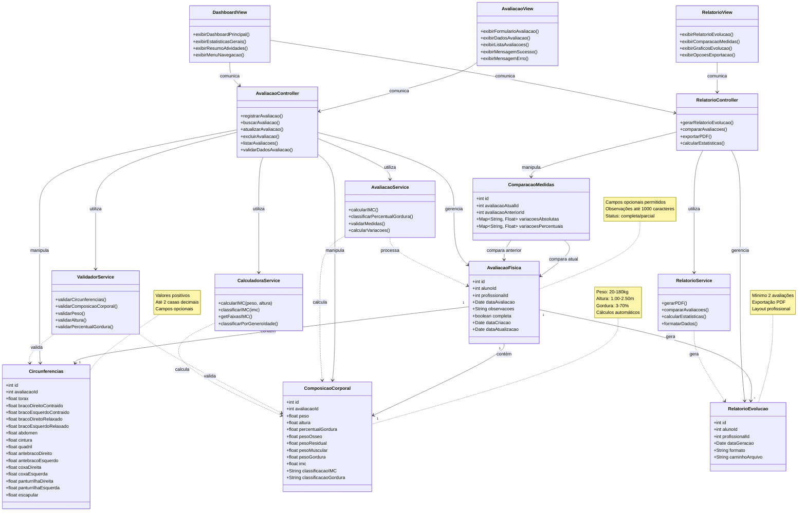

# Diagrama de Classes - Sistema de Registro de Circunferências Corporais (Arquitetura MVC)

## Diagrama de Classes - Arquitetura MVC

## Arquitetura MVC - Descrição das Camadas

### **CAMADA MODEL (MODELOS)**
Representa os dados e a lógica de negócio do sistema.

#### **Entidades Principais:**
- **AvaliacaoFisica**: Entidade central que contém todas as medidas de uma avaliação
- **Circunferencias**: Armazena medidas de circunferência corporal
- **ComposicaoCorporal**: Armazena dados de peso, altura e composição corporal
- **RelatorioEvolucao**: Representa relatórios gerados
- **ComparacaoMedidas**: Armazena comparações entre avaliações

### **CAMADA CONTROLLER (CONTROLADORES)**
Gerencia a lógica de controle e coordenação entre Model e View.

#### **Controladores:**
- **AvaliacaoController**: Gerencia operações de avaliação física
- **RelatorioController**: Gerencia geração e manipulação de relatórios

### **CAMADA VIEW (INTERFACES)**
Responsável pela apresentação dos dados ao usuário.

#### **Views:**
- **AvaliacaoView**: Interface para formulários e exibição de avaliações
- **RelatorioView**: Interface para visualização de relatórios
- **DashboardView**: Interface principal do sistema

### **SERVIÇOS E UTILITÁRIOS**
Classes de apoio que fornecem funcionalidades específicas.

#### **Serviços:**
- **AvaliacaoService**: Cálculos e validações de avaliação
- **RelatorioService**: Geração e formatação de relatórios
- **ValidadorService**: Validações de dados
- **CalculadoraService**: Cálculos matemáticos e classificações

## Funcionalidades Implementadas

✅ **US10**: Registro de circunferências corporais (AC1-AC3)
✅ **US13**: Registro de peso, altura e percentual de gordura (AC4-AC9)
✅ **US17**: Adição de observações (AC10-AC15)
✅ **US15**: Visualização do histórico (AC16-AC19)
✅ **US12**: Registro múltiplas medidas (AC20-AC25)
✅ **US14**: Visualização do IMC (AC26-AC30)
✅ **US16**: Geração de relatórios (AC31-AC33)
✅ **US11**: Comparação de medidas (AC34-AC36)

## Padrões de Design Utilizados na Arquitetura MVC

### **Padrão MVC (Model-View-Controller)**
- **Separação de Responsabilidades**: Cada camada tem uma responsabilidade específica
- **Model**: Gerencia dados e lógica de negócio
- **View**: Responsável pela apresentação e interface do usuário
- **Controller**: Coordena a comunicação entre Model e View

### **Padrões Adicionais:**
- **Composição**: AvaliacaoFisica composta por Circunferencias e ComposicaoCorporal
- **Service Layer**: Serviços especializados para cálculos e validações
- **Dependency Injection**: Controllers utilizam Services para operações específicas
- **Single Responsibility**: Cada classe tem uma única responsabilidade bem definida

### **Benefícios da Arquitetura MVC:**
- **Manutenibilidade**: Código organizado e fácil de manter
- **Testabilidade**: Cada camada pode ser testada independentemente
- **Escalabilidade**: Fácil adição de novas funcionalidades
- **Reutilização**: Services podem ser reutilizados por diferentes Controllers
- **Flexibilidade**: Views podem ser alteradas sem afetar a lógica de negócio
