# Diagrama de Classes - Módulo de Planejamento (Arquitetura MVC)

## Diagrama de Classes - Arquitetura MVC para Planejamento

```mermaid
classDiagram
    %% ===== CAMADA MODEL (MODELOS + SERVIÇOS + UTILITÁRIOS) =====
    
    %% Entidades Principais
    class PlanoTreino {
        +int id
        +int alunoId
        +int profissionalId
        +String nome
        +String descricao
        +Date dataInicio
        +Date dataFim
        +String objetivo
        +String nivel
        +boolean ativo
        +Date dataCriacao
        +Date dataAtualizacao
    }

    class Exercicio {
        +int id
        +String nome
        +String descricao
        +String grupoMuscular
        +String equipamento
        +String nivelDificuldade
        +String instrucoes
        +String observacoes
        +boolean ativo
    }

    class SerieExercicio {
        +int id
        +int planoId
        +int exercicioId
        +int ordem
        +int series
        +int repeticoes
        +float carga
        +int tempoDescanso
        +String observacoes
        +boolean concluido
    }

    class Treino {
        +int id
        +int planoId
        +String nome
        +String descricao
        +int ordemSemana
        +String diaSemana
        +int duracaoEstimada
        +String observacoes
        +boolean ativo
    }

    class HistoricoTreino {
        +int id
        +int treinoId
        +int alunoId
        +Date dataExecucao
        +int duracaoReal
        +String observacoes
        +float pesoUtilizado
        +int repeticoesExecutadas
        +boolean completo
        +Date dataCriacao
    }

    class ProgressaoTreino {
        +int id
        +int planoId
        +int exercicioId
        +Date dataInicio
        +Date dataFim
        +float cargaInicial
        +float cargaFinal
        +int repeticoesInicial
        +int repeticoesFinal
        +String tipoProgressao
        +String observacoes
    }

    class ObjetivoTreino {
        +int id
        +int planoId
        +String tipoObjetivo
        +String descricao
        +float valorMeta
        +String unidadeMedida
        +Date dataLimite
        +boolean alcancado
        +Date dataAlcancado
        +String observacoes
    }

    %% Serviços e Utilitários (Parte da Camada Model)
    class PlanoTreinoService {
        +validarPlanoTreino()
        +calcularDuracaoPlano()
        +verificarConflitosHorarios()
        +sugerirExercicios()
        +otimizarPlano()
    }

    class ExercicioService {
        +validarExercicio()
        +categorizarExercicio()
        +calcularIntensidade()
        +sugerirVariacoes()
        +verificarEquipamentos()
    }

    class TreinoService {
        +validarTreino()
        +calcularDuracaoTreino()
        +verificarSequenciaExercicios()
        +otimizarOrdemExercicios()
        +calcularVolumeTreino()
    }

    class ProgressaoService {
        +calcularEvolucao()
        +sugerirProximaCarga()
        +verificarPlateau()
        +ajustarProgressao()
        +calcularPercentualEvolucao()
    }

    class ObjetivoService {
        +validarObjetivo()
        +calcularProgresso()
        +verificarViabilidadeObjetivo()
        +sugerirAjustesObjetivo()
        +calcularTempoEstimado()
    }

    class EstatisticaService {
        +calcularEstatisticasTreino()
        +gerarRelatorioProgresso()
        +calcularFrequenciaTreinos()
        +analisarConsistencia()
        +calcularMediasProgresso()
    }

    class ValidadorService {
        +validarDadosPlano()
        +validarDadosExercicio()
        +validarDadosTreino()
        +validarDadosProgressao()
        +validarDadosObjetivo()
    }

    class CalculadoraService {
        +calcularVolumeTreino()
        +calcularIntensidadeMedia()
        +calcularFrequenciaSemanal()
        +calcularProgressaoPercentual()
        +calcularTempoRecuperacao()
    }

    %% ===== CAMADA CONTROLLER (CONTROLADORES) =====
    class PlanoTreinoController {
        +criarPlanoTreino()
        +buscarPlanoTreino()
        +atualizarPlanoTreino()
        +excluirPlanoTreino()
        +listarPlanosPorAluno()
        +ativarDesativarPlano()
    }

    class ExercicioController {
        +cadastrarExercicio()
        +buscarExercicio()
        +atualizarExercicio()
        +excluirExercicio()
        +listarExercicios()
        +filtrarPorGrupoMuscular()
        +filtrarPorEquipamento()
    }

    class TreinoController {
        +criarTreino()
        +buscarTreino()
        +atualizarTreino()
        +excluirTreino()
        +listarTreinosPorPlano()
        +adicionarExercicioTreino()
        +removerExercicioTreino()
        +reordenarExercicios()
    }

    class HistoricoController {
        +registrarExecucaoTreino()
        +buscarHistoricoTreino()
        +listarHistoricoPorAluno()
        +listarHistoricoPorTreino()
        +gerarRelatorioProgresso()
    }

    class ProgressaoController {
        +registrarProgressao()
        +buscarProgressao()
        +atualizarProgressao()
        +listarProgressoesPorExercicio()
        +calcularEvolucao()
        +sugerirProximaCarga()
    }

    class ObjetivoController {
        +definirObjetivo()
        +buscarObjetivo()
        +atualizarObjetivo()
        +marcarObjetivoAlcancado()
        +listarObjetivosPorPlano()
        +calcularProgressoObjetivo()
    }

    %% ===== CAMADA VIEW (INTERFACES) =====
    class PlanoTreinoView {
        +exibirFormularioCriacao()
        +exibirDadosPlano()
        +exibirListaPlanos()
        +exibirDetalhesPlano()
        +exibirMensagemSucesso()
        +exibirMensagemErro()
    }

    class ExercicioView {
        +exibirFormularioExercicio()
        +exibirDadosExercicio()
        +exibirListaExercicios()
        +exibirFiltrosExercicios()
        +exibirDetalhesExercicio()
    }

    class TreinoView {
        +exibirFormularioTreino()
        +exibirDadosTreino()
        +exibirListaTreinos()
        +exibirExerciciosTreino()
        +exibirCronogramaSemanal()
    }

    class HistoricoView {
        +exibirFormularioExecucao()
        +exibirHistoricoTreinos()
        +exibirEstatisticasProgresso()
        +exibirGraficosEvolucao()
        +exibirRelatorioProgresso()
    }

    class ProgressaoView {
        +exibirFormularioProgressao()
        +exibirDadosProgressao()
        +exibirGraficosEvolucao()
        +exibirSugestoesCarga()
        +exibirComparacaoPeriodos()
    }

    class ObjetivoView {
        +exibirFormularioObjetivo()
        +exibirDadosObjetivo()
        +exibirListaObjetivos()
        +exibirProgressoObjetivo()
        +exibirObjetivosAlcancados()
    }

    class DashboardPlanejamentoView {
        +exibirDashboardPlanejamento()
        +exibirResumoPlanos()
        +exibirEstatisticasGerais()
        +exibirProximosTreinos()
        +exibirObjetivosPendentes()
    }

    %% ===== RELACIONAMENTOS MVC =====
    
    %% Relacionamentos Model (Entidades)
    PlanoTreino "1" --> "*" Treino : contém
    PlanoTreino "1" --> "*" SerieExercicio : possui
    PlanoTreino "1" --> "*" ProgressaoTreino : gera
    PlanoTreino "1" --> "*" ObjetivoTreino : define
    
    Exercicio "1" --> "*" SerieExercicio : utilizado
    Exercicio "1" --> "*" ProgressaoTreino : evolui
    
    Treino "1" --> "*" HistoricoTreino : executado
    Treino "1" --> "*" SerieExercicio : inclui
    
    %% Relacionamentos Service -> Model (Entidades)
    PlanoTreinoService ..> PlanoTreino : processa
    ExercicioService ..> Exercicio : processa
    TreinoService ..> Treino : processa
    TreinoService ..> SerieExercicio : processa
    ProgressaoService ..> ProgressaoTreino : calcula
    ObjetivoService ..> ObjetivoTreino : calcula
    EstatisticaService ..> HistoricoTreino : analisa
    
    %% Relacionamentos Service -> Service
    PlanoTreinoService --> ValidadorService : utiliza
    ExercicioService --> ValidadorService : utiliza
    TreinoService --> ValidadorService : utiliza
    ProgressaoService --> CalculadoraService : utiliza
    ObjetivoService --> CalculadoraService : utiliza
    EstatisticaService --> CalculadoraService : utiliza
    
    %% Relacionamentos Controller -> Model (Entidades + Services)
    PlanoTreinoController --> PlanoTreino : gerencia
    PlanoTreinoController --> PlanoTreinoService : utiliza
    
    ExercicioController --> Exercicio : gerencia
    ExercicioController --> ExercicioService : utiliza
    
    TreinoController --> Treino : gerencia
    TreinoController --> SerieExercicio : manipula
    TreinoController --> TreinoService : utiliza
    
    HistoricoController --> HistoricoTreino : gerencia
    HistoricoController --> EstatisticaService : utiliza
    
    ProgressaoController --> ProgressaoTreino : gerencia
    ProgressaoController --> ProgressaoService : utiliza
    
    ObjetivoController --> ObjetivoTreino : gerencia
    ObjetivoController --> ObjetivoService : utiliza
    
    %% Relacionamentos View -> Controller
    PlanoTreinoView --> PlanoTreinoController : comunica
    ExercicioView --> ExercicioController : comunica
    TreinoView --> TreinoController : comunica
    HistoricoView --> HistoricoController : comunica
    ProgressaoView --> ProgressaoController : comunica
    ObjetivoView --> ObjetivoController : comunica
    DashboardPlanejamentoView --> PlanoTreinoController : comunica
    DashboardPlanejamentoView --> HistoricoController : comunica

    %% Notas e Observações
    note for PlanoTreino "Plano completo de treino<br/>Duração: 4-12 semanas<br/>Objetivos específicos"
    
    note for Exercicio "Catálogo de exercícios<br/>Grupos musculares<br/>Equipamentos necessários"
    
    note for Treino "Sessão de treino<br/>Exercícios específicos<br/>Ordem e intensidade"
    
    note for HistoricoTreino "Registro de execução<br/>Dados reais vs planejado<br/>Progresso individual"
    
    note for PlanoTreinoService "Validação e otimização<br/>Sugestões inteligentes<br/>Cálculos de duração"
    
    note for EstatisticaService "Análises avançadas<br/>Relatórios detalhados<br/>Métricas de performance"
```

## Arquitetura MVC - Descrição das Camadas para Planejamento

### **CAMADA MODEL (MODELOS + SERVIÇOS + UTILITÁRIOS)**
Representa os dados, lógica de negócio e serviços do módulo de planejamento.

#### **Entidades Principais:**
- **PlanoTreino**: Plano completo de treino com objetivos e duração
- **Exercicio**: Catálogo de exercícios com instruções e equipamentos
- **SerieExercicio**: Configuração específica de séries e repetições
- **Treino**: Sessão de treino com exercícios organizados
- **HistoricoTreino**: Registro de execução dos treinos
- **ProgressaoTreino**: Evolução das cargas e repetições
- **ObjetivoTreino**: Metas específicas do plano de treino

#### **Serviços e Utilitários (Parte da Camada Model):**
- **PlanoTreinoService**: Validação e otimização de planos
- **ExercicioService**: Categorização e validação de exercícios
- **TreinoService**: Cálculos e otimização de treinos
- **ProgressaoService**: Cálculos de evolução e sugestões
- **ObjetivoService**: Validação e cálculo de objetivos
- **EstatisticaService**: Análises e relatórios estatísticos
- **ValidadorService**: Validações gerais de dados
- **CalculadoraService**: Cálculos matemáticos e métricas

### **CAMADA CONTROLLER (CONTROLADORES)**
Gerencia a lógica de controle e coordenação entre Model e View.

#### **Controladores:**
- **PlanoTreinoController**: Gerencia operações de planos de treino
- **ExercicioController**: Gerencia catálogo de exercícios
- **TreinoController**: Gerencia sessões de treino
- **HistoricoController**: Gerencia histórico de execução
- **ProgressaoController**: Gerencia evolução do treino
- **ObjetivoController**: Gerencia objetivos e metas

### **CAMADA VIEW (INTERFACES)**
Responsável pela apresentação dos dados ao usuário.

#### **Views:**
- **PlanoTreinoView**: Interface para criação e visualização de planos
- **ExercicioView**: Interface para catálogo de exercícios
- **TreinoView**: Interface para sessões de treino
- **HistoricoView**: Interface para histórico e estatísticas
- **ProgressaoView**: Interface para evolução do treino
- **ObjetivoView**: Interface para objetivos e metas
- **DashboardPlanejamentoView**: Interface principal do módulo

## Funcionalidades do Módulo de Planejamento

✅ **Criação de Planos de Treino**: Planos personalizados com objetivos específicos
✅ **Catálogo de Exercícios**: Base de dados com exercícios categorizados
✅ **Configuração de Treinos**: Sessões organizadas com séries e repetições
✅ **Registro de Execução**: Histórico detalhado dos treinos realizados
✅ **Acompanhamento de Progressão**: Evolução das cargas e performance
✅ **Gestão de Objetivos**: Definição e acompanhamento de metas
✅ **Relatórios e Estatísticas**: Análises de progresso e performance

## Padrões de Design Utilizados na Arquitetura MVC

### **Padrão MVC (Model-View-Controller)**
- **Separação de Responsabilidades**: Cada camada tem uma responsabilidade específica
- **Model**: Gerencia dados, lógica de negócio e serviços
- **View**: Responsável pela apresentação e interface do usuário
- **Controller**: Coordena a comunicação entre Model e View

### **Padrões Adicionais:**
- **Composição**: PlanoTreino composto por Treinos e Exercícios
- **Service Layer**: Serviços especializados integrados à camada Model
- **Dependency Injection**: Controllers utilizam Services da camada Model
- **Single Responsibility**: Cada classe tem uma única responsabilidade bem definida
- **Strategy Pattern**: Diferentes tipos de progressão e objetivos

### **Benefícios da Arquitetura MVC:**
- **Manutenibilidade**: Código organizado e fácil de manter
- **Testabilidade**: Cada camada pode ser testada independentemente
- **Escalabilidade**: Fácil adição de novos tipos de exercícios e planos
- **Reutilização**: Services podem ser reutilizados por diferentes Controllers
- **Flexibilidade**: Views podem ser alteradas sem afetar a lógica de negócio
