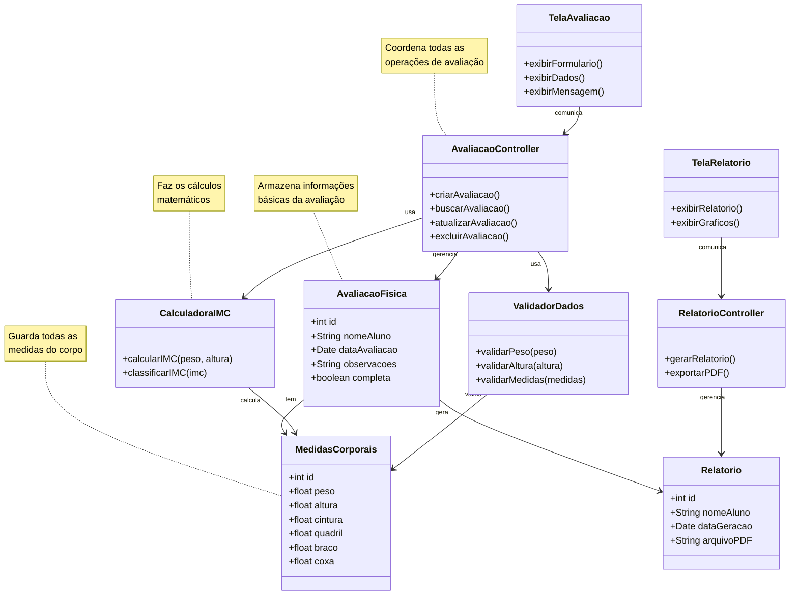

# Diagrama de Classes - Sistema de Avaliação Física (Versão Simplificada)

## O que é um Diagrama de Classes?

Um diagrama de classes é como um "mapa" que mostra:
- **O que o sistema faz** (as funcionalidades)
- **Como as partes se conectam** (os relacionamentos)
- **Quais informações são armazenadas** (os dados)

É como um projeto de uma casa antes de construí-la!

## Diagrama de Classes Simplificado

## Explicação Simples das Partes do Sistema

### 🗂️ **DADOS (Model)**
São como "gavetas" onde guardamos as informações:

- **AvaliacaoFisica**: Guarda informações básicas (nome do aluno, data, observações)
- **MedidasCorporais**: Guarda todas as medidas do corpo (peso, altura, cintura, etc.)
- **Relatorio**: Guarda informações dos relatórios gerados

### ⚙️ **LÓGICA DE NEGÓCIO (Services)**
São como "calculadoras inteligentes" que fazem os cálculos:

- **CalculadoraIMC**: Calcula o IMC e diz se está normal, acima do peso, etc.
- **ValidadorDados**: Verifica se os dados estão corretos (peso não pode ser negativo, etc.)

### 🎮 **CONTROLE (Controller)**
São como "gerentes" que coordenam tudo:

- **AvaliacaoController**: Gerencia tudo relacionado às avaliações (criar, buscar, atualizar, excluir)
- **RelatorioController**: Gerencia tudo relacionado aos relatórios (gerar, exportar)

### 🖥️ **INTERFACE (View)**
São as telas que o usuário vê e usa:

- **TelaAvaliacao**: Tela para preencher dados da avaliação
- **TelaRelatorio**: Tela para ver relatórios e gráficos

## Como Funciona na Prática?

1. **Usuário** preenche dados na **TelaAvaliacao**
2. **TelaAvaliacao** envia dados para o **AvaliacaoController**
3. **AvaliacaoController** pede para o **ValidadorDados** verificar se está tudo certo
4. **AvaliacaoController** pede para o **CalculadoraIMC** calcular o IMC
5. **AvaliacaoController** salva os dados na **AvaliacaoFisica** e **MedidasCorporais**
6. **AvaliacaoController** avisa a **TelaAvaliacao** que deu tudo certo

## Analogia com uma Lanchonete

- **DADOS** = Cardápio e pedidos (o que tem disponível e o que foi pedido)
- **SERVICES** = Cozinha (fazem os lanches e verificam se tem ingredientes)
- **CONTROLLER** = Garçom (recebe pedidos e coordena tudo)
- **VIEW** = Mesa e cardápio (onde o cliente vê e escolhe)

## Benefícios desta Organização

✅ **Fácil de entender**: Cada parte tem uma função específica
✅ **Fácil de modificar**: Se quiser mudar uma tela, não afeta o resto
✅ **Fácil de testar**: Pode testar cada parte separadamente
✅ **Fácil de expandir**: Pode adicionar novas funcionalidades sem quebrar o que já existe

## Próximos Passos para Iniciantes

1. **Entenda cada classe**: O que cada uma faz
2. **Veja os relacionamentos**: Como elas se conectam
3. **Pense em exemplos**: Como isso funcionaria na vida real
4. **Comece simples**: Implemente uma classe por vez
5. **Teste sempre**: Verifique se está funcionando antes de continuar
